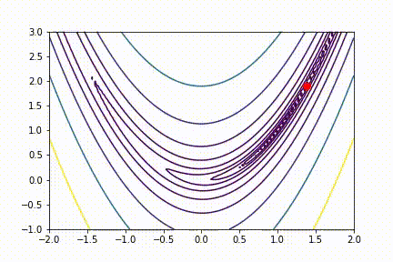

# Reporte Técnico - Taller de optimización combinatoria

## Integrantes
* Andres Felipe Cadena Velez
* Juan Felipe Usuga Villegas
* Cristian David Quinchia Ramirez
* Juan Diego Marin Rodriguez
* Juan Pablo Rivera Sierra

## 1. **Introducción**

El siguiente reporte técnico trata sobre optimizaciones en dos funciones matematicas. La optimización es un área clave en la ciencia y la ingeniería, y se utiliza para encontrar la solución óptima a una amplia variedad de problemas en muchos campos diferentes.”En los problemas de optimización, generalmente, nosotros buscamos por la mejor solución(o una suficientemente buena) de un problema entre un montón de alternativas”(Zhang, 2007). La función de Rosenbrock es una función de varias variables no convexa que a menudo se utiliza como un benchmark para evaluar el rendimiento de los algoritmos de optimización, mientras que la función de Rastrigin es otra función no convexa comúnmente utilizada como un problema de optimización global.

”El método de descenso por gradiente es un algoritmo iterativo usado a menudo en problemas de optimización para encontrar el mínimo local de una función de costo arbitrario”(Sever, 2023). Los algoritmos evolutivos, la optimización de partículas y la evolución diferencial son otros métodos populares de optimización que utilizan conceptos como la selección natural y la simulación de comportamientos de grupo de partículas para encontrar el mínimo global.

El objetivo de la primera parte de este trabajo es comparar el rendimiento de estos diferentes métodos de optimización en la resolución de los problemas de optimización de las funciones de Rosenbrock y Rastrigin. Para ello, se pueden utilizar técnicas de programación para implementar cada uno de los métodos de optimización y analizar su rendimiento en términos de velocidad de convergencia, precisión de la solución y capacidad para encontrar el mínimo global.

Y tambien trata acerca de la optimización de recorridos entre diferentes ciudades de Colombia en un carro. Un vendedor desea dirigirse a 15 ciudades sin importar el orden del itinerario, es decir, no importa si va a una ciudad antes que otra, lo que importa es que el recorrido sea lo mas económico posible en terminos de dinero.

Las 15 ciudades son:
- Palmira
- Pasto
- Tuluá
- Bogotá
- Pereira
- Armenia
- Caldas
- Valledupar
- Montería
- Soledad
- Cartagena
- Barranquilla
- Medellín
- Bucaramanga
- Cúcuta

Para el desarrollo del objetivo planteado (optimizar las rutas) se utilizará el método colonias de hormigas y algoritmos genéticos.

## 2. **Desarrollo técnico**
### 2.1.1. **Definición del algoritmo de hormigas**
Deacuerdo al algoritmo de optimización hormigas se realiza la definición del algoritmo en python que se utilizará en conjunto con las rutas a optmizar.
https://github.com/Akavall/AntColonyOptimization/blob/c585c5cfc9b0e6b709322ac15fe1e2193b20d8e4/ant_colony.py

### 2.1.2. **Preparación de los datos**
Para preparar los datos de las rutas se siguen los pasos de identificación de peajes, identificación de distancias de las rutas y coordenadas y calculo de de costo de viajes

### 2.1.3. **Identificación de peajes**
Para la identificación de peajes usamos la página https://www.peajesencolombia.com/ de la cual buscaron todos los peajes entre los destinos posibles

Una vez obtenidos los peajes importaron y se procesaron para tenerlos en un dataset de peajes
### 2.1.4 **Identificación de distancias de las rutas y coordenadas**
Para la obtención de rutas y coordenadas se utilizó una librería que nos permitió obtener las distancias de las rutas en tiempo real: openrouteservice
Para obtener la distancia de cada combinación posible de rutas se realizó una consulta por API utilizando los nombres de las ciudades especificando departamento, ya que podrían a llegar a existir ciudades homónimas

`"Palmira, Valle del cauca, Colombia", 
    "Pasto, Nariño, Colombia", "Tulua, Valle del cauca, Colombia", 
    "Bogota, Colombia", "Pereira, Risaralda, Colombia", 
    "Armenia, Quindio, Colombia",
    "Manizales, Caldas, Colombia", "Valledupar, Cesar, Colombia",
    "Monteria, Cordoba, Colombia", "Soledad, Atlantico, Colombia",
    "Cartagena, Bolivar, Colombia", "Barranquilla, Atlantico, Colombia" ,
    "Medellin, Antioquia, Colombia", "Bucaramanga, Santander, Colombia", 
    "Cucuta, Norte de Santander, Colombia"`

### 2.1.5. **Calculo de de costo de viajes**
Una vez con las distancias de todas las combinaciones, se procede a obtener a calcular el costo de cada ruta deacuerdo al valor de la gasolina: $10.766/galón teniendo encuenta un consumo promedio de 58 kms/galón. El consumo se toma de un vehiculo mazda cx-5: https://www.elcarrocolombiano.com/pruebas/mazda-cx-5-signature-a-prueba-un-suv-con-turbo-y-mucho-picante-video/#:~:text=En%20cuanto%20al%20consumo%2C%20est%C3%A1,58%20km%2Fgal%C3%B3n%20en%20carretera

viaje_por_galon = 58 * 1000
precio_gasolina = 10766
precio_peaje = se mapea dependiendo de cada ruta

Adicionalment se calcula la cantidad de horas de viaje para tener en cuenta el costo por hora del vendedor: cantidad_horas_viaje = distancia / VELOCIDAD_MAXIMA, donde velocidad maxima es de 80km/hora
El costo del tiempo del empleado es costo_vendedor = cantidad_horas_viaje * SALARIO_VENDEDOR, donde el salario del vendedor por hora es $7.690

Para obtener el precio de cada ruta se ejecuta la formula ((distancia_ruta / viaje_por_galon) * precio_gasolina) + precio_peaje + costo_vendedor

### 2.1.6. **Optimización de datos bajo algoritmo de hormigas**
Para obtimizar la mejor ruta se toma los costos de las rutas totales obtenidas y se guardan en una matriz que es recibida por la función de obtimización.
Para lo anterior se probaron dos casos para validar el resultado optimo uno con número de hormigas igual a 1 y otro igual a 150

Adicionalmente se enviaron los parámetros:
- n_best: 150
- n_iterations: 1000
- decay: 0.95
- alpha: 1
- beta: 1

### 2.2.1. **Definición de funciones Rosenbrock**
“La función de Rosenbrock es una conocida función de prueba para problemas de optimización numérica, el cual fue inicialmente usado por De Jong para probar el desempeño de algoritmos genéticos”(Yun-Wei Shang, 2006). La implementación de la función de Rosenbrock en 2D y 3D se realiza mediante las funciones "rosenbrock_2d" (1-x)2+100*(y-x2)2 y "rosenbrock_3d" (1-x)2+100*(y-x2)2+(1-y)2+100*(z-y2)2, respectivamente. 

### 2.2.2. **Definición de funciones Rastrigin**
La implementación de la función de Rastrigin en 2D y 3D se realiza mediante las funciones "rastrigin_2d" 10*2+(x2-10*cos(2**x))+(y2-10*cos(2**y)) y "rastrigin_3d" 10*3+(x2-10*cos(2**x))+(y2-10*cos(2**y))+ 
(z2-10*cos(2**z)), respectivamente. La función "grad_rastrigin_2d" y "grad_rastrigin_3d" implementan el gradiente de la función de Rastrigin en 2D y 3D, respectivamente.

### 2.2.3. **Definición la optimización por metodo gradiente para la función de Rosenbrock**
El método de descenso por gradiente se implementa mediante la función "gradient_descent". Este método es una técnica de optimización iterativa que se utiliza para encontrar el mínimo de una función mediante la actualización de los valores de los parámetros en la dirección opuesta del gradiente de la función. En cada iteración, se calcula el gradiente de la función en el punto actual y se actualiza el valor de los parámetros multiplicándose por la tasa de aprendizaje. El proceso se repite hasta que se alcance una tolerancia determinada o se llegue a un número máximo de iteraciones.

En el código se genera una visualización en 2D de la función de Rosenbrock y la trayectoria de búsqueda del algoritmo de descenso por gradiente. Primero se define la función "plot_rosenbrock_2d" que toma como entrada un arreglo de puntos que representan los valores de x e y obtenidos por el algoritmo de descenso por gradiente en cada iteración. Luego, se genera una condición inicial aleatoria en dos dimensiones y se llama a la función "gradient_descent" con los parámetros necesarios para aplicar el algoritmo de descenso por gradiente y almacenar los resultados en la variable "xs_2d". Finalmente, se llama a la función "plot_rosenbrock_2d" con la variable "xs_2d" como entrada para visualizar los resultados.

### 2.2.4. **Definición la optimización por metodo gradiente para la función de Rosenbrock**
En el código se genera una visualización en 2D de la función de Rastrigin y la trayectoria de búsqueda del algoritmo de descenso por gradiente. Primero se define la función "plot_rastrigin_3d" que toma como entrada un arreglo de puntos que representan los valores de x e y obtenidos por el algoritmo de descenso por gradiente en cada iteración y el valor de z obtenido de la función “rastrigin_2d”. Luego, se genera una condición inicial aleatoria en tres dimensiones y se llama a la función "gradient_descent" con los parámetros necesarios para aplicar el algoritmo de descenso por gradiente y almacenar los resultados en la variable "xs_3d".

Finalmente, se llama a la función "plot_rastrigin_3d" con la variable "xs_3d" como entrada para visualizar los resultados.

### 2.2.5. **Definición la optimización por metodo evolución diferencia para la función de Rosenbrock en dos dimensiones**
La función de objetivo a minimizar se define en el código a través de la función "obj" que se pasa como parámetro en la función "differential_evolution".

El algoritmo Evolución Diferencial utiliza una población de vectores, cada uno de los cuales representa una posible solución. En cada iteración, el algoritmo selecciona tres vectores aleatorios de la población y realiza una operación de mutación para generar un nuevo vector de prueba. A continuación, se realiza una operación de cruce entre el vector de prueba y un vector objetivo seleccionado al azar. Si el vector de prueba es mejor que el vector objetivo, el vector objetivo se reemplaza por el vector de prueba en la población. Este proceso se repite durante varias iteraciones hasta que se alcanza un criterio de parada, que suele ser un número máximo de iteraciones o una tolerancia en la mejora de la función objetivo.

El código implementa varias funciones auxiliares que se utilizan en el algoritmo DE, incluyendo una función de mutación, una función de cruce, una función de selección, una función de comprobación de límites y una función para generar la población inicial aleatoria.

La función "differential_evolution" es la función principal del algoritmo y toma como parámetros el tamaño de la población, los límites de las variables de la función objetivo, el número máximo de iteraciones, el factor de escala F y la tasa de cruce cr. Retorna una lista que contiene el mejor vector encontrado, el valor de la función objetivo en ese vector, una lista que contiene los valores de la función objetivo en cada iteración y una lista que contiene los mejores vectores encontrados en cada iteración.

Ahora implementamos la optimización de la función de Rosenbrock en dos dimensiones utilizando el algoritmo de diferencias evolutivas (DE). Primero, se define el tamaño de la población (pop_size), los límites inferior y superior para cada dimensión (bounds), el número de iteraciones (iter), el factor de escala para la mutación (F) y la tasa de recombinación cruzada (cr). Luego, se llama a la función differential_evolution() con estos parámetros, junto con la función de Rosenbrock en dos dimensiones (rosen2) como la función objetivo.

Después de ejecutar el algoritmo DE, se crea una malla de puntos en el rango de -5.12 a 5.12 para evaluar la función de Rosenbrock en dos dimensiones y se dibuja su contorno en un plano bidimensional. Luego, se extraen las coordenadas x e y de la mejor solución encontrada (solution[3]) y se dibuja una línea roja que conecta estos puntos en el plano del contorno. Finalmente, se muestra el gráfico con la mejor solución encontrada en rojo y las curvas de contorno de la función objetivo de Rosenbrock en el fondo.

### 2.2.6. **Definición la optimización por metodo evolución diferencia para la función de Rosenbrock en tres dimensiones**
Para optimizar la ecuaciones de Rosenbrock en tres dimensiones con evolución diferencial. Primero se definen los parámetros necesarios para ejecutar el algoritmo, incluyendo el tamaño de la población, los límites inferior y superior de cada dimensión, el número de iteraciones, el factor de escala para la mutación y la tasa de cruce para la recombinación.

Luego, se llama a la función differential_evolution con estos parámetros y la función objetivo rosen3, que es la versión tridimensional de la función de Rosenbrock. La función devuelve una tupla que contiene la mejor solución encontrada, el valor de la función objetivo para esa solución, el número de evaluaciones de la función objetivo realizadas y una lista de todas las soluciones generadas durante la búsqueda.

A continuación, se crea una malla de puntos en el rango de -5.12 a 5.12 para las dimensiones x e y, y se evalúa la función objetivo en cada punto de la malla para crear una superficie tridimensional. Luego, se extraen las coordenadas x, y, y z de la mejor solución encontrada y se plotea esta solución en rojo en la superficie tridimensional.

Finalmente, se muestra la figura con las gráficas utilizando la función plt.show().

### 2.2.7. **Definición la optimización por metodo evolución diferencia para la función de Rastrigin en dos dimensiones**
Para optimizar la ecuaciones de Rastrigin en dos dimensiones con evolución diferencial. Primero, se definen los parámetros necesarios para la función differential_evolution:

pop_size: tamaño de la población de soluciones candidatas.
bounds: límites inferior y superior para cada dimensión del espacio de búsqueda.
iter: número de iteraciones del algoritmo.
F: factor de escala para la operación de mutación.
cr: tasa de cruce para la operación de recombinación.
Luego, se llama a la función differential_evolution con estos parámetros y con la función objetivo que se quiere optimizar, en este caso rast2. La solución devuelta por la función es una lista que contiene el vector de solución óptimo, el valor de la función objetivo en ese punto, una lista de los valores de la función objetivo en cada iteración y una lista de los puntos de solución en cada iteración.

Finalmente, se crea un gráfico que muestra las curvas de nivel de la función de Rastrigin en dos dimensiones, junto con una línea que muestra cómo la mejor solución encontrada por el algoritmo mejora a lo largo de las iteraciones. En el gráfico se puede ver cómo la solución converge lentamente hacia el mínimo global de la función.

### 2.2.8. **Definición la optimización por metodo evolución diferencia para la función de Rastrigin en tres dimensiones**
Para optimizar la ecuaciones de Rastrigin en tres dimensiones con evolución diferencial (rast3). El proceso es similar al código anterior, pero en este caso se utiliza un conjunto de límites (-5.12 a 5.12) para las 3 dimensiones de la función.

Primero se define el tamaño de la población (pop_size), los límites para cada dimensión (bounds), el número de iteraciones (iter), el factor de escala para la mutación (F) y la tasa de cruce para la recombinación (cr). Luego se utiliza la función differential_evolution para encontrar la solución óptima de la función rast3.

Después, se crea una malla de puntos para evaluar la función en 3D y se grafica la superficie resultante con el comando ax.plot_surface. Finalmente, se plotea la trayectoria seguida por el algoritmo para encontrar la solución óptima, utilizando las coordenadas obtenidas en la variable solution3d[3] (x,y,z). El resultado es una visualización en 3D de la función Rastrigin y la trayectoria seguida por el algoritmo para encontrar el mínimo global.

### 2.2.9. **Definición la optimización por metodo de enjambre de particulas para ambas funciones de Rastrigin en dos dimensiones**
Ahora implementamos el código de algoritmo de Optimización por Enjambre de Partículas (PSO) para encontrar el mínimo global de una función en 2D .

La clase Particle define las partículas que componen el enjambre. Cada partícula tiene una posición y velocidad inicial aleatoria, y se guarda la mejor posición y valor de aptitud (fitness) que ha encontrado hasta el momento. La función de aptitud se calcula a partir de la posición actual de la partícula y se almacena en el atributo fitness.

La clase Swarm es el enjambre en sí mismo, que consta de un número de partículas. La función update se encarga de actualizar la posición y velocidad de cada partícula en función de su mejor posición encontrada hasta ahora y de la mejor posición encontrada por todo el enjambre. También se actualiza la función de aptitud de cada partícula y se actualizan los valores de la mejor posición y valor de aptitud encontrados hasta ahora por el enjambre.

La función test_pso es un ejemplo de cómo se puede utilizar esta implementación para encontrar el mínimo global de una función. Se crea un enjambre de 20 partículas y se actualiza durante 50 iteraciones. La función devuelve una lista de todas las posiciones que ha tomado cada partícula en cada iteración, la mejor posición encontrada por el enjambre y el valor de aptitud correspondiente a esa posición. En esta parte tendremos como resultado una función qué recibe ambas funciones y las optimiza.

### 2.2.10. **Definición la optimización por metodo de enjambre de particulas para ambas funciones de Rastrigin en tres dimensiones**
Ahora implementamos el código de algoritmo de Optimización por Enjambre de Partículas (PSO) para encontrar el mínimo global de una función en 3D.

En primer lugar, se define la clase Particle que tiene los siguientes atributos: position (posición de la partícula), velocity (velocidad de la partícula), best_position (mejor posición de la partícula) y best_fitness (el valor de la función en la mejor posición). El constructor de la clase inicializa la posición y velocidad de cada partícula de forma aleatoria.

Luego se define la clase Swarm que tiene los siguientes atributos: n_particles (número de partículas), particles (lista de partículas), best_position (mejor posición global) y best_fitness (mejor valor de la función global). El constructor de la clase crea una lista de partículas con posiciones y velocidades aleatorias.

La clase Swarm tiene un método update(func) que actualiza la posición y velocidad de cada partícula y actualiza las mejores posiciones y valores de la función tanto para cada partícula como para todo el enjambre.

La función test_pso_3D(func) crea un enjambre de partículas y actualiza sus posiciones y velocidades por 50 iteraciones. Retorna una lista con las posiciones de todas las partículas en cada iteración, la mejor posición global y el mejor valor de la función global. En esta parte tendremos como resultado una función qué recibe ambas funciones y las optimiza.

### 2.2.11. **Definición la optimización por metodo de de algoritmo genético para ambas funciones de Rastrigin en dos dimensiones**
Implementamos el código de un algoritmo genético para encontrar el mínimo global de una función en dos variables.
En la clase Individual, se definen los atributos x e y que representan las variables de la función, y el atributo fitness que representa la evaluación de la función en esos valores de x e y.
La función create_population inicializa una población de individuos aleatorios, cada uno con valores aleatorios de x e y.
La función selection realiza la selección de los mejores individuos de la población, utilizando la función sorted para ordenar la población por su valor de fitness y devolviendo la mitad mejor.
La función crossover realiza la cruza entre dos padres, calculando el promedio de sus valores de x e y para generar un hijo.
La función mutation realiza la mutación de un individuo, con una cierta tasa de mutación dada por rate. Si un número aleatorio es menor que la tasa de mutación, se agrega un valor aleatorio pequeño a los valores de x e y. Luego, se recalcula el valor de fitness.
La función genetic_algorithm implementa el algoritmo genético en sí. Comienza generando la población inicial, luego itera sobre un número dado de generaciones. En cada generación, se realiza la selección, cruza y mutación de la población para generar la próxima generación. También se realiza un seguimiento del mejor individuo de la población en cada generación y se guarda su posición y valor de fitness en la lista solutions. Al final, se devuelve esta lista de soluciones. En esta parte tendremos como resultado una función qué recibe ambas funciones y las optimiza.

### 2.2.12. **Definición la optimización por metodo de de algoritmo genético para ambas funciones de Rastrigin en tres dimensiones**
Usaremos un código para implementar un algoritmo genético para encontrar el mínimo global de una función de tres variables en un espacio tridimensional. El código es similar al de un algoritmo genético para dos variables que discutimos anteriormente, pero se ha extendido para manejar tres variables.
La función objetivo se define en términos de tres variables, x, y, y z, y se pasa a la función de inicialización, create_population, que crea una población inicial de individuos con coordenadas aleatorias en el rango de -5 a 5. Luego, el algoritmo procede a repetir el proceso de selección, cruce y mutación durante varias generaciones para producir una población final de soluciones.

La selección se realiza seleccionando los individuos más aptos (con menor valor de fitness) de la población actual, y cruzando pares seleccionados al azar para crear nuevos individuos (los hijos). Los nuevos individuos pueden sufrir mutaciones aleatorias, que consisten en un cambio aleatorio en cada una de sus coordenadas, con una probabilidad especificada por el usuario.

El proceso de selección, cruce y mutación se repite durante un número especificado de generaciones, y en cada generación, se registra la mejor solución de la población actual.

Finalmente, el algoritmo devuelve una lista de soluciones que contienen las coordenadas de cada mejor solución encontrada en cada generación, junto con su valor de fitness correspondiente.

El código es útil para encontrar el mínimo global de una función de tres variables, y se puede modificar para adaptarse a funciones con cualquier número de variables. En esta parte tendremos como resultado una función qué recibe ambas funciones y las optimiza.

## 4. **Conclusiones**
Con respecto a la optimización de hormigas, se analizaron las posibles rutas más óptimas de hormigas para 1 y 150 hormigas y se evidencia que la ruta óptima es la misma.
Se encuentra que la ruta optima es:

En general se mostró que el algoritmo genético, puede ser mejor para optimización, dado que éste converge más rápido que los otros algoritmos, tanto en la función de Rosenbrock como en la de Rastrigin, y además se puede apreciar que el algoritmo genético converge en un mínimo global, mientras que el Gradiente puede converger a distintos locales.
La función Rastrigin es una buena función para poder probar algoritmos de optimización y ver cuales algoritmos funcionan para llegar a un mínimo global y cuales funcionan para llegar a mínimos locales.

## **Referencias:**
- Peajes en Colombia: https://www.peajesencolombia.com/
- Algoritmo de optmización de hormigas: https://github.com/Akavall/AntColonyOptimization/blob/c585c5cfc9b0e6b709322ac15fe1e2193b20d8e4/ant_colony.py
- Consumo de carro: https://www.elcarrocolombiano.com/pruebas/mazda-cx-5-signature-a-prueba-un-suv-con-turbo-y-mucho-picante-video/#:~:text=En%20cuanto%20al%20consumo%2C%20est%C3%A1,58%20km%2Fgal%C3%B3n%20en%20carretera
- Valor hora vendedor: https://co.talent.com/salary?job=vendedor
- Shang, Y. W., & Qiu, Y. H. (2006). A Note on the Extended Rosenbrock Function. Evolutionary Computation, 14(1), 119-126. https://doi.org/10.1162/evco.2006.14.1.119
- Zhang, S., Zhu, K., & Zhang, W. (2021b). Multivariate correlation matrix-based deep learning model with enhanced heuristic optimization for short-term traffic forecasting. IEEE Transactions on Knowledge and Data Engineering, 1-1. https://doi.org/10.1109/tkde.2021.3118389
- Sever, K., Golušin, L. M., & Lončar, J. (2023b). Optimization of Gradient Descent Parameters in Attitude Estimation Algorithms. Sensors, 23(4), 2298. https://doi.org/10.3390/s23042298 
